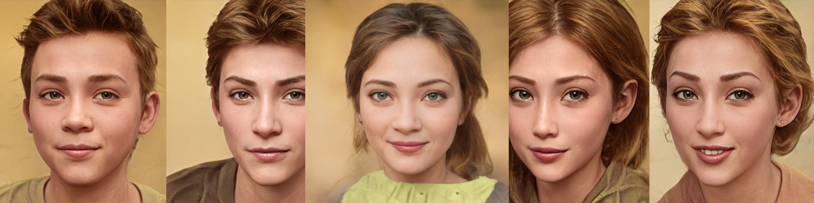

# Welcome to NFTSharingTop 2
We are thrilled to announce the launch of multiple NFT collections, designed to bring boundless joy to our valued users. In the near future, we have exciting plans to introduce Real World Asset NFTs (rwaNFTs) that will be intricately intertwined with these collections. Our utmost desire is for all holders to revel in the sheer delight and enjoyment that these NFTs will bring.

## 3. Idol and Idiot
[idolandidiot](https://opensea.io/collection/idolandidiot) is a collection of 18 unique NFTs living on the Ethereum blockchain. 

  

 
## 2. Three Good Friends
[Three Good Friends](https://opensea.io/collection/three-good-friends) is a collection of 4 unique NFTs living on the Ethereum blockchain. They have secret energy power that could bring health, wealth and happiness to you.

  

 
## 1. Five Men and Five Women
[Five Men and Five Women](https://opensea.io/collection/five-men-and-five-women) is a collection of 10 unique NFTs living on the Blockchain, which is generated by artificial intelligence (AI) and picked out from millions of samples..

  

  
  
  
  
    

## ▪ Relative links

[http://nftsharing.top](http://nftsharing.top)

[http://nftsharing.top/2](http://nftsharing.top/2)

## ▪ Terms & Conditions
Before purchasing this NFT, please read carefully the [Terms Of Service](http://nftsharing.top/terms/) and the [Terms & Conditions](http://nftsharing.top/nft-owner-agreement/) specific to this NFT. This explains all your rights and any restrictions.
